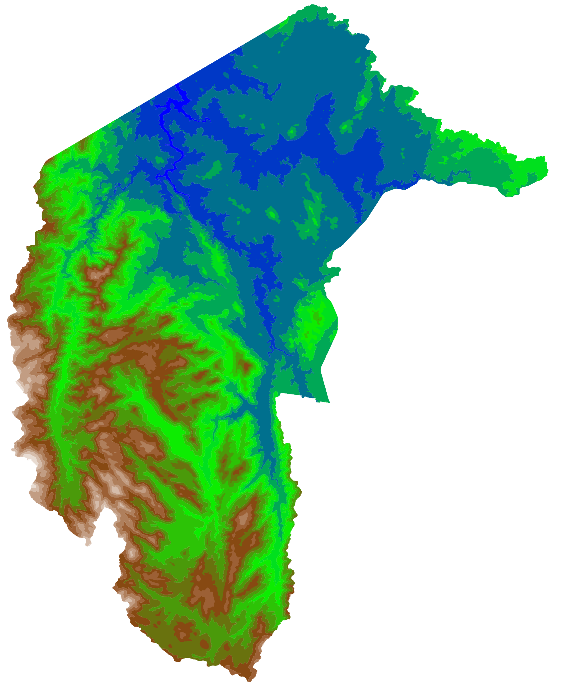

# Contour-Tpography
This project helps with topography contour rendering. 
Only requires a geotiff file containing altitudes encoded as grayscales to create a parametric object with parametric rendering options.

## Examples




## Usages
```shell
    TIF_DATA = os.path.join("../data/canberra.tif")
    BORDER_DATA = os.path.join("../data/ACTGOV_BORDER_8764495160505726925.geojson")
    OUT_DATA = os.path.join("../data/generated2")

    canberra_map = Map(tif_file=TIF_DATA, borders_geojson=BORDER_DATA)
    canberra_map.compute_all_layers(level_step=100)
    canberra_map.save_layers(save_path=OUT_DATA, color=True, combined=True, for_cut=False)
```

# Prerequisites
This project needs geotiff to be installed.

**Linux Debian-like**
```shell
sudo apt update
sudo apt install \
    unixodbc unixodbc-dev \
    libblosc-dev \
    libarmadillo-dev \
    libqhull-r8.0 libqhull-dev \
    libxerces-c-dev \
    libgeotiff-dev \
    libaec-dev \
    libnetcdf-dev \
    libcfitsio-dev \
    libhdf5-dev \
    libkml-dev \
    libfyba-dev \
    libspatialite-dev \
    libmysqlclient-dev \
    libfreexl-dev \
    libgeos-dev \
    libproj-dev \
    libhdf4-0 \
    libhdf4-dev
```
Make sure its shared libraries are accessible by the python interpreter.