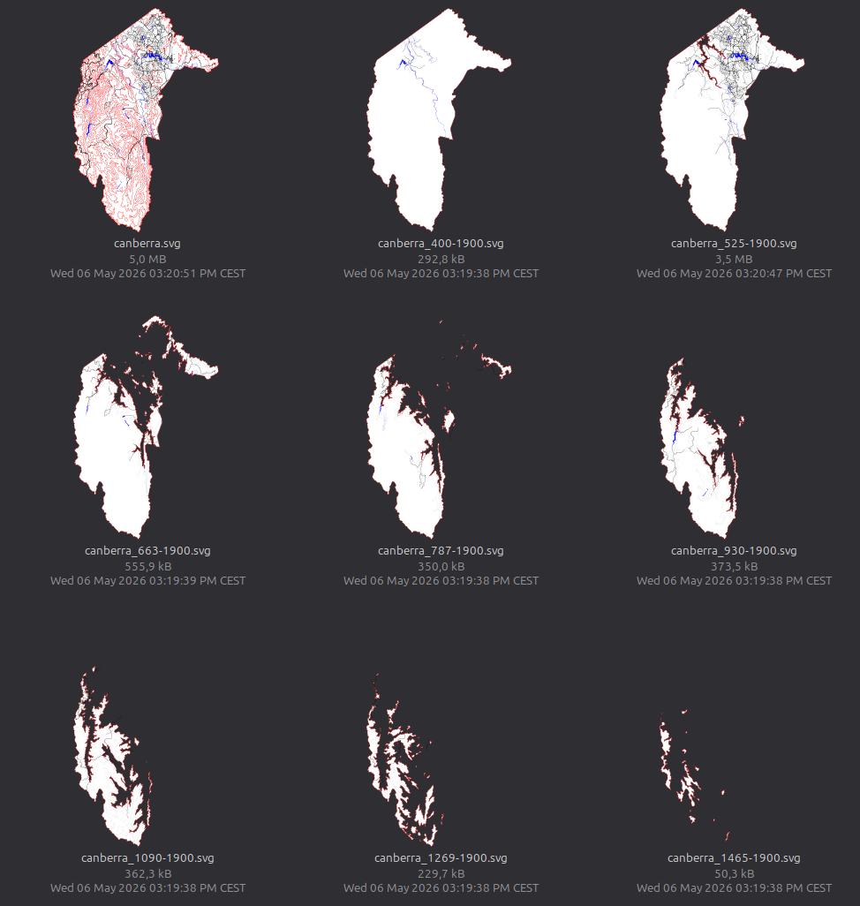
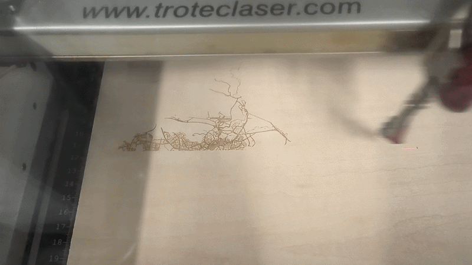
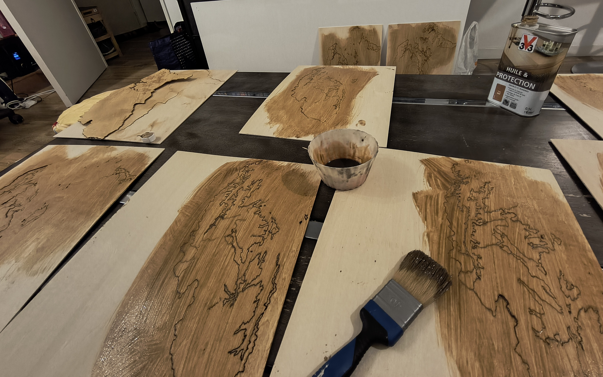
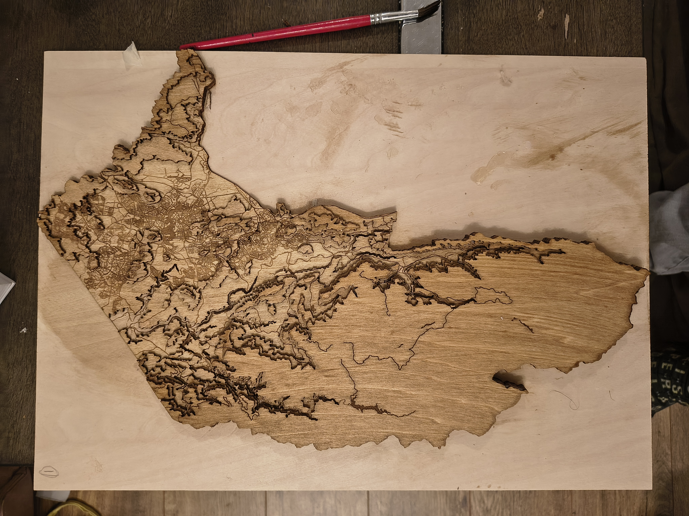
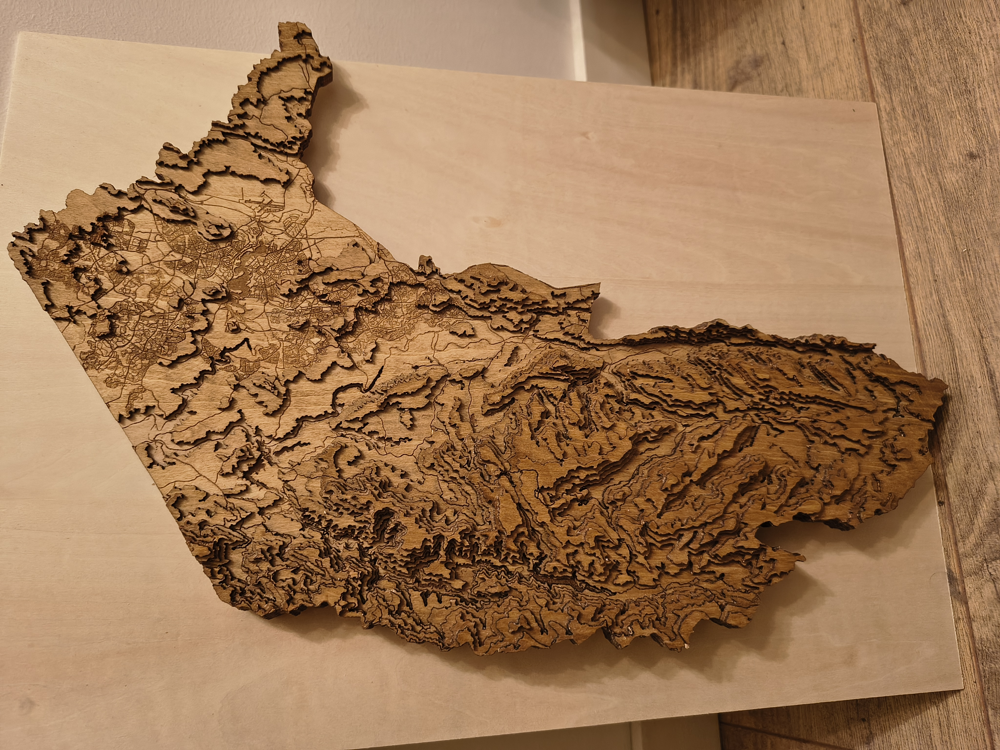

# Contour Topography
This project helps with topography contour rendering. 
Requires a geotiff file containing altitudes encoded as grayscales to create a parametric object with parametric rendering options.

## Process

### Step 1 - Rendering a preview
Render a preview of the final result for iterative changes.
First try is the charm !


### Step 2 - Generating Layers
The laser machine handles one layer at a time, so we generate each elevation layer file individually.
Cutting lines are highlighted in red. The rest is grayscale color engraving.



### Step 3 - Lasering The fun (and slow) part !
Distant roads will noticeably slow the laser head



### Step 4 - The Oling 
Protective/devorative wood oil is applied to give each layer a different color gradient for each given elevation.
Quantity applied by feel. 




### Step 5 - Assembling 
Each layer is then glued the one below. This step took the most time overall as the glue must dry before starting the next layer (40mins - 1h per layer).
The wood may buckle due to the oil previously applied, I used heavy object to pin down each layer while the glue dried.
My Programming books gathering dust on my library have never been so useful.



### Final Result





## Usage

```python
from data_models.map import Map
from data_models.roads_weights import RoadsWeight

tif_data =  # path to tif file
borders_data =  # path to Geojson borders file
roads_data =  # path to roads geojson file
save_path =  # out path

contour_map = Map(tif_file=tif_data, borders_geojson=border_data, roads_geojson=roads_data)
contour_map.road_detail = 0x8B
contour_map.road_scaling = RoadsWeight.RANKING_1

contour_map.generate_elevation_layers(level_steps=list(range(556, 2000, 100)))
contour_map.save_all_layers(save_path=dst, combined=True, for_cut=False)
```

# Datasets
The australian government's website https://www.data.gov.au has been a real gold mine.
- [ACT waterbodies: actmapi-actgov.opendata.arcgis.com](https://actmapi-actgov.opendata.arcgis.com/datasets/0466cc9915e043989cee1952a107e663_0/)
- [ACT roads: actmapi-actgov.opendata.arcgis.com](https://actmapi-actgov.opendata.arcgis.com/datasets/ACTGOV::actgov-road-centrelines/)
- [ACT airport: actmapi-actgov.opendata.arcgis.com](https://actmapi-actgov.opendata.arcgis.com/datasets/6e461f9650c84788ab787791eb884c8c_0/)
- [Sydney roads: portal.spatial.nsw.gov.au](https://portal.spatial.nsw.gov.au/client/services?id=d6cba899a13041d2a8c0eb4ca734b69e)
- [Sydney borders: citydata.ada.unsw.edu.au](https://citydata.ada.unsw.edu.au/dataset/lgas_sydney_and_surrounds/resource/e66a0534-450f-4386-890d-2daed56f0086)

Also:
- ACT Borders: https://services1.arcgis.com/E5n4f1VY84i0xSjy/arcgis/rest/services/ACTGOV_BORDER/FeatureServer/replicafilescache/ACTGOV_BORDER_8764495160505726925.geojson
- AUS Elevation Data: https://ecat.ga.gov.au/geonetwork/srv/api/records/a05f7892-eebe-7506-e044-00144fdd4fa6?language=eng

# Prerequisites
This project needs GDAL and Inkscape to be installed.

**Linux Debian-like**
```shell
sudo apt update
# inkscape
sudo apt  install inkscape 
# GDAL
sudo apt install \
    unixodbc unixodbc-dev \
    libblosc-dev \
    libarmadillo-dev \
    libqhull-r8.0 libqhull-dev \
    libxerces-c-dev \
    libgeotiff-dev \
    libaec-dev \
    libnetcdf-dev \
    libcfitsio-dev \
    libhdf5-dev \
    libkml-dev \
    libfyba-dev \
    libspatialite-dev \
    libmysqlclient-dev \
    libfreexl-dev \
    libgeos-dev \
    libproj-dev \
    libhdf4-0 \
    libhdf4-dev\
    gdal-bin\
    libgdal-dev
```
Make sure shared libraries are accessible by the python interpreter.


# Coordinates:

**Canberra**
```bash
Upper Left  ( 148.7548611, -35.1195833) (148d45'17.50"E, 35d 7'10.50"S)
Lower Left  ( 148.7548611, -35.9251389) (148d45'17.50"E, 35d55'30.50"S)
Upper Right ( 149.4170833, -35.1195833) (149d25' 1.50"E, 35d 7'10.50"S)
Lower Right ( 149.4170833, -35.9251389) (149d25' 1.50"E, 35d55'30.50"S)
Center      ( 149.0859722, -35.5223611) (149d 5' 9.50"E, 35d31'20.50"S)
```

**Sydney**
```bash
150.58 -33.5
150.58 -34.22
151.5 -33.5
151.35 -34.22
```

```bash
150.9 -33.65
150.9 -33.99
151.5 -33.5
151.35 -34.22
```